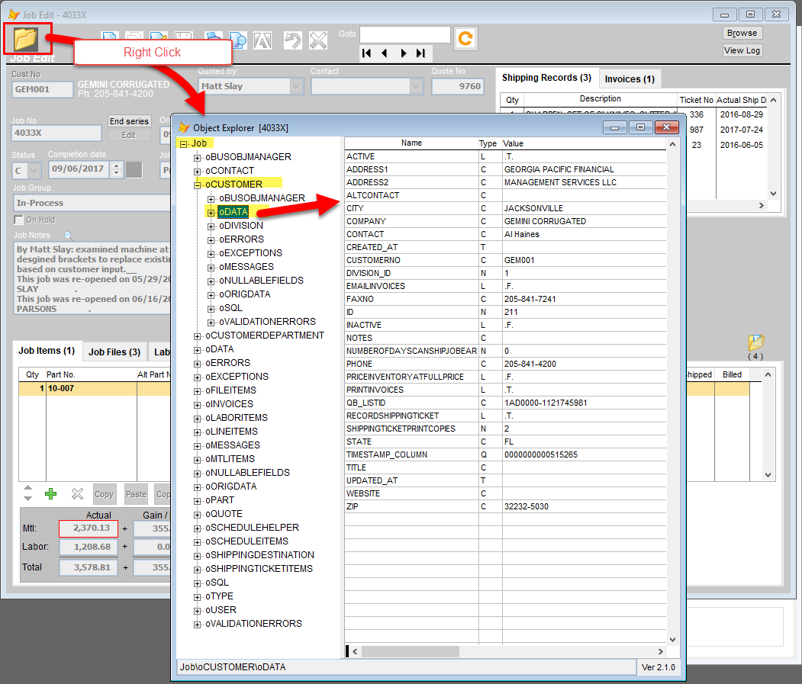
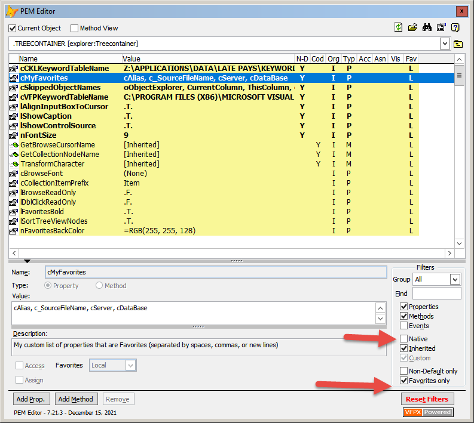

# Object Explorer

Version 3.4.02 Released 2023/07/29

[What's new in this release](Change%20Log.md)

***

*Provides an explorer form to view members of the specified object.*

By Jim Nelson and Matt Slay



*From Jim Nelson:*

In honor of my very good friend, the late Matt Slay, I want to share the last tool we collaborated on.

The tool is not actually our concept at all, as it derives from two other tools that have been in the community for a long time (see the original message, below, that got us started.)

All that we did was to customize an existing tool, add some features, eliminate some bugs, and provide some customization.

It's called rather simply: Do Form Explorer with (Object Reference)

The trick to making this a really valuable tool was to find the following unexpected way to call it. We have added the following line of code into our production code and also for use in our IDE:

```
On Key Label F9 Do Form Explorer with Sys(1270)
```

You can invoke Explorer at any time by hovering over any object in any form and using the hot key, and Explorer will open for that object and the form it belongs to.

We find that this is invaluable in Production; it also works in IDE the same way although we do not use it there as often.

There are also some very pleasant unanticipated uses. Try any of these:

* Do Form Explorer_Modal with _Screen

* Using the hotkey over a form in the IDE, such as GoFish, PEMEditor, or Thor, will let you view their insides. Since Explorer is a form as well, you get use it to spy on itself.

* Using the hotkey over a form or class you are editing in the IDE works like a reduced-function version of the Properties Window or PEMEditor. A curiosity, maybe, but navigation is easy and so is modifying properties.

* Make the following little piece of code available in your app (for me, available from a context menu available only to Devs). It created a collection of ALL your open forms to browse.

    ```
    Local loForms As 'Collection'
    Local lnI
    loForms = Newobject('Collection')
    For lnI = 1 To _Screen.FormCount
        m.loForms.Add(_Screen.Forms[m.lni])
    Endfor
    Do Form Explorer_Modal With m.loForms, 'All Forms'
    ```

A few technical notes:

* This does not depend on Thor being installed (amazing, eh?)

* The three files in this release are intended to be self-contained and have no external references.

* The VCX is the base which Matt and I worked on and shared. (If anybody were to make changes to share with the group, they should be in the VCX)

* The SCXs are our forms where we customized the base VCX as desired.

* I always use the modal form in production. (Use the modeless form at your own risk.) You may well choose to change some of the native form settings as appropriate for your environment.

* Nodes are added to the TreeView only when you expand a parent node.

* The grid on the right is recreated each time you click a node.

* The filter box finds all matches in either the property name or value.

* There is a browse button at the bottom left, available if Explorer (known as Dora to her friends) can determine the cursor related to the current node (such as a grid or column in a grid)

* There are a number of properties and methods, in both the form and its main object "TreeContainer", available for customization. These are easily accessed using PEMEditor, as they are are Local. There's a description field for each.

    

* One such method is LogChange, which is called each time any property is changed (by double-clicking in the grid's value column). The parameters should contain all the information you might want to record for later review. Override this method in whichever SCX you use as the ObjectExplorer form.

One last thing: a hidden UI feature is the ability to edit properties by double-clicking in the value column of the grid. You can also view and edit properties of arrays the same way.

*From Matt Slay, Nov 18, 2017:*

I've always used Tamar Granor's [Object Inspector](https://github.com/VFPX/ObjectInspector) in my deployed app in a hidden way, in that on from any CRUD forms, I can right click on the icon in the upper left of the form, and I can use the Object Inspector to see everything on the MainBO, which, is a *lot* of automatically populated stuff from my wwBusinessPro trickery.  I find this helpful to dig around on some of the data that is probably on the data objects but may not be display on the forms, and sometimes I need that data for various reasons.

Anyway, I have this one BO that Object Inspector chokes on when it parses the object to fetch all the data to show on the form. I racked by brain and screwed around with my BO for a couple of hours thinking it was some junk I had in my object hierarchy. I never could figure it out. It caused "a too many nested do loops " error on my BO for some reason that did not happen at run time, and I could not cause the same error on that BO from the command window, no matter what I tried to call or invoke.

Then on a whim I used an old tool I got from Mike Feltman's 2008 SWFox session on Collections. (The tool works on arrays and nested objects too, so it's not just about Collections, so the name Collection Explorer was ill-chosen if you ask me). That tool parsed the BO just fine and never triggered the same error on my BO methods as it parsed the BO. Go figure!

So, I am relieved about that and I'm switching away from Object Inspector to this new tool.

One cool thing about his tool is that it is only one single SCX form. No classlibs at all, no .APP file, no dependencies on anything but native FoxPro controls. The original form had 3 controls and that's it. I added a 4th control as a label in the bottom right hand corner. It it very lightweight, and only have about 8 methods to do everything. Very easy to follow code, very clean and simple.

I've also added some other functionality, like if one of the property values in the grid is a cursor name, you can double-click on it to browse that cursor. Tthe tools runs against the current data session that it was called from, so it can see and browse those cursors with double-click. (All of my child BO's store the cursor name in a property, and there are other cursor names references in other properties, so it's handy to fire off a Browse from any cursor name.)

I also renamed this tool to Object Explorer (not to be confused with Tamar's Object Inspector).

[What's new in this release](Change%20Log.md)

----
## Helping with this project
See [How to contribute to Object Inspector](.github/CONTRIBUTING.md) for details on how to help with this project.

Last changed: _2023/01/19_ 
